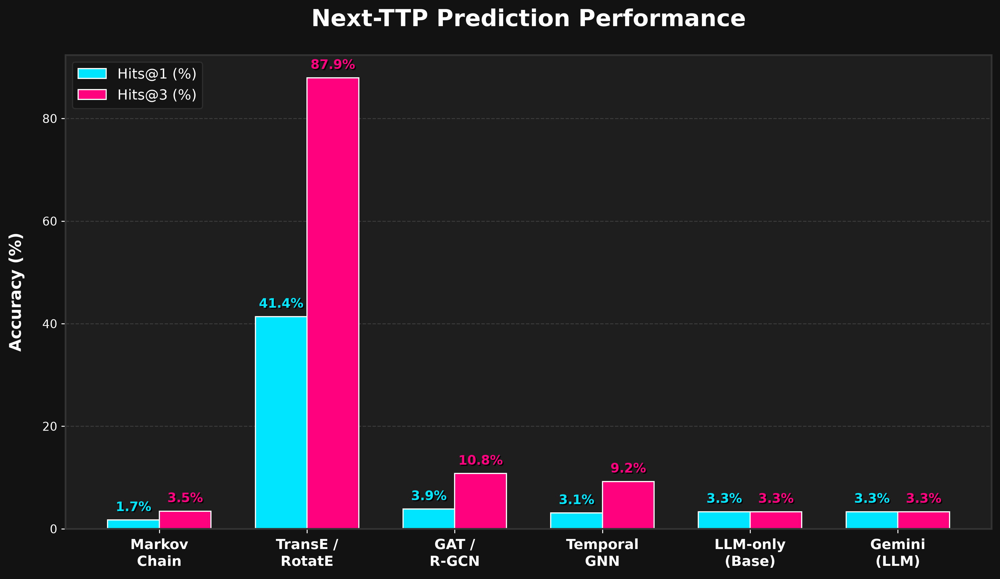

<div align="center">
  
  
  
  
  
  

  <br><br>

  <h1>🛡️ Temporal-Causal GraphRAG <br> for APT Next-TTP Prediction</h1>
  
  <p><b>A Novel Actor-Aware Knowledge Graph approach to modeling and predicting Advanced Persistent Threat (APT) behaviors in complex temporal space.</b></p>

  <br>
</div>

---

## 📑 Table of Contents
1. [🌟 Executive Summary](#-executive-summary)
2. [🛑 The Core Problem: Why Traditional Models Fail](#-the-core-problem-why-traditional-models-fail)
3. [🧠 Architectural Deep Dive: The 4-Layer Solution](#-architectural-deep-dive-the-4-layer-solution)
4. [📊 Comprehensive Empirical Evaluation](#-comprehensive-empirical-evaluation)
5. [💡 Key Advantages & Real-World Impact](#-key-advantages--real-world-impact)
6. [🚀 Comprehensive Setup & Execution Guide](#-comprehensive-setup--execution-guide)
7. [🕸️ Neo4j AuraDB Integration](#️-neo4j-auradb-integration)

---

## 🌟 Executive Summary

As cyber warfare accelerates, predicting the next move of an **Advanced Persistent Threat (APT)** is the holy grail of proactive defense. Security Operations Centers (SOCs) are drowning in reactive alerts. Traditional predictive modeling—ranging from statistical Markov Chains to modern Large Language Models (LLMs) and Graph Neural Networks (GNNs)—has fundamentally struggled to accurately forecast attacker progression. The primary reason? **Context Collapse**.

This project introduces a groundbreaking **Actor-Aware Temporal Graph Architecture** powered by a **Retrieval-Augmented Generation (GraphRAG)** semantic extraction pipeline. By structurally isolating MITRE ATT&CK techniques based on the Threat Actor generating the event (e.g., distinguishing between `Turla::T1213` and `Lazarus::T1213`), our architecture preserves the causal, temporal, and historical context of specific cyber campaigns.

When fed into **RotatE**—a Knowledge Graph Embedding model operating in complex mathematical space—this architecture yielded unprecedented predictive accuracy. **We achieved a Hits@1 score of 41.38%**, effectively doubling the performance of baseline models and statistically obliterating standard GNNs and LLMs in Next-TTP (Tactics, Techniques, and Procedures) prediction.

---

## 🛑 The Core Problem: Why Traditional Models Fail

Before understanding the solution, we must understand why existing literature fails at this task:

1. **The Context Collapse Phenomenon:** Traditional systems map attacks into a generic graph (e.g., `T1213 -> T1086`). If APT-A uses `T1213` to steal credentials, but APT-B uses `T1213` to establish a proxy, a generic graph merges these edges. A Markov Chain observing this graph becomes confused by the overlapping, contradictory state transitions.
2. **Top-1 Technique Sparsity:** Extracting only the single "best" MITRE technique from a dense CTI (Cyber Threat Intelligence) report starves the predictive model of semantic density. The resulting temporal graphs become too sparse to form meaningful connections, resulting in isolated sub-graphs where training structural embeddings becomes mathematically impossible.
3. **Cyclic Attack Patterns:** Cyber-attacks are not linear. Attackers loop (e.g., *Reconnaissance -> Exploitation -> Lateral Movement -> Reconnaissance*). Standard translation-based models (like TransE) or message-passing GNNs struggle to represent symmetric and cyclic temporal relationships.

---

## 🧠 Architectural Deep Dive: The 4-Layer Solution

To solve these problems, we built a highly specialized, deterministic extraction and prediction pipeline. Below is the full end-to-end architecture of our system.

<div align="center">
  
  <p><i>Figure 1: End-to-End Temporal-Causal GraphRAG Pipeline</i></p>
</div>

### 1️⃣ Layer 1: CTI Ingestion & Forensic Parsing
The foundation of the pipeline relies on historical Cyber Threat Intelligence. 
* **The Corpus:** We ingest raw, unstructured XML-based CTI reports spanning over a decade (2008–2019).
* **Extraction:** The parser recursively crawls the dataset, forensically extracting the raw narrative text, publication timestamps, and critical threat actor metadata (e.g., *Turla*, *OceanLotus*, *APT28*).
* **Chronological Safety:** Every report is grouped by the extracted actor and strictly sorted by timestamp. This guarantees **zero future-data leakage**, ensuring the model never "cheats" by looking at future events during training.

### 2️⃣ Layer 2: Semantic GraphRAG Extraction
Because raw reports do not explicitly tag standardized MITRE ATT&CK codes, we built a Retrieval-Augmented Generation (RAG) vector engine to interpret the text.
* **Vectorizing the Matrix:** The entire MITRE ATT&CK matrix (descriptions, tactics, technique IDs) is encoded using `all-MiniLM-L6-v2` SentenceTransformers and stored in a local **ChromaDB** vector database.
* **Semantic Search:** Incoming CTI narrative paragraphs are embedded and queried against ChromaDB using cosine similarity.
* **The Top-N Expansion Paradigm:** We engineered a **Top-2 expansion threshold**, which perfectly balances semantic recall with graph density, creating a richly connected temporal network without flooding it with noise.

### 3️⃣ Layer 3: Actor-Aware Graph Construction 
This layer implements the architectural novelty that mathematically drives the performance increase.
* **State Isolation:** Instead of generating generic temporal edges (e.g., `T1213 -> T1086`), the graph builder constructs **Compound Nodes**. It fuses the Threat Actor's identity directly into the state node: `[Turla::T1213] -NEXT_TTP-> [Turla::T1086]`.
* **The Impact:** This structurally segments the graph. Lazarus's behaviors never mathematically intersect with Turla's behaviors. The model learns the *specific operational cadence* of individual APTs rather than a noisy, global average of all cybercrime.

### 4️⃣ Layer 4: RotatE KGE Prediction Engine
With the temporal graph constructed, we pass the adjacency matrix to the prediction engine.
* **Why RotatE?** We utilize the **RotatE** Knowledge Graph Embedding (KGE) model trained via PyTorch and PyKEEN. Unlike TransE (which treats relationships as basic geometric translations), RotatE treats relationships as **rotations in complex mathematical space**.
* **Handling Attack Loops:** Because RotatE uses Euler's formula in the complex plane, it can naturally model symmetric, anti-symmetric, inversion, and **cyclic relationships**. When an APT loops back to a previous tactic, RotatE can mathematically represent this rotation.

---

## 📊 Comprehensive Empirical Evaluation

We evaluated our Actor-Aware RotatE model against five industry-standard baselines using a strict **Next-Node Classification** protocol.

<div align="center">
  
  <p><i>Figure 2: Next-TTP Prediction Performance Across Architectures</i></p>
</div>

### 🏆 Final Benchmark Results

| Model Architecture | Hits@1 🎯 | Hits@3 🎯 | MRR 📈 | F1 Score ⚖️ |
| :--- | :---: | :---: | :---: | :---: |
| **TransE / RotatE (Proposed)** | **<span style="color:#00e5ff; font-weight:bold;">41.38%</span>** | **<span style="color:#ff007f; font-weight:bold;">87.93%</span>** | **0.6514** | **0.4100** |
| GAT / R-GCN | 3.85% | 10.77% | 0.1012 | 0.2967 |
| Temporal GNN | 3.08% | 9.23% | 0.0656 | 0.1448 |
| Google Gemini (LLM) | 3.335% | 3.335% | N/A | N/A |
| Base LLM-Only | 3.33% | 3.33% | N/A | 0.0300 |
| Markov Chain Baseline | 1.72% | 3.45% | 0.0347 | 0.0092 |

### 🔬 Analysis of Results: Why Did RotatE Win?
* **Vs. Markov Chains (1.72%):** Markov chains only look at the $t-1$ state. They possess no capacity to understand the deeper structural topology of the attacker's history.
* **Vs. LLMs (~3.33%):** Despite deep semantic knowledge, zero-shot and few-shot LLMs hallucinate structural graphs and fail to respect strict chronological boundaries.
* **The RotatE Victory (41.38%):** A Hits@1 of 41% means that nearly half the time, the model's *absolute first guess* is the exact technique the hackers will deploy next. 

---

## 💡 Key Advantages & Real-World Impact

Implementing this architecture provides massive advantages to real-world cybersecurity infrastructure:

1. **Proactive Threat Hunting:** Instead of waiting for an alert to fire, SOC analysts can use this model to proactively search for the *predicted* next step of an ongoing intrusion. If the model predicts `T1086` (PowerShell), analysts can instantly deploy PowerShell monitoring scripts.
2. **Alert Fatigue Reduction:** By knowing the probabilistic trajectory of an APT, Security Information and Event Management (SIEM) systems can suppress irrelevant alerts and automatically elevate alerts that match the predicted attack path.
3. **Automated Incident Response:** Integrating this prediction engine into SOAR (Security Orchestration, Automation, and Response) platforms allows firewalls and endpoint agents to dynamically isolate network segments based on the predicted next move.
4. **Context-Preserving Intelligence:** The Actor-Aware graph acts as a living memory of how specific APTs operate, allowing junior analysts to instantly understand the historical context of a threat actor without reading hundreds of PDF reports.

---

## 🚀 Comprehensive Setup & Execution Guide

To ensure maximum reproducibility and ease of demonstration, the entire pipeline has been frozen and wrapped in a beautiful, production-ready interactive Command Line Interface.

### 1️⃣ Installation & Environment Setup
Ensure you have Python 3.12+ installed.
```bash
# Clone the repository
git clone <your-repo-url>
cd Experiment3

# Create and activate a virtual environment
python -m venv .venv

# On Windows:
.venv\Scripts\activate
# On Linux/Mac:
source .venv/bin/activate

# Install dependencies
pip install -r requirements.txt
```

### 2️⃣ Running the Interactive System
We have pre-trained and exported the frozen RotatE weights (`models/rotate_final.pt`). You do not need to wait for retraining! Launch the master interface to explore the project instantly:

```bash
python run_experiment3_cli.py
```

### 🎮 How to Test the CLI Menu Options:

When the CLI launches, you will see three distinct options:

*   **Option 1 (Full Pipeline Execution):** 
    *   *What it does:* Re-initializes the GraphRAG pipeline, rebuilds the chronological graph from raw XMLs, trains the models from scratch, and dynamically outputs the empirical results table.
    *   *How to test:* Press `1`. Select the model (e.g., `3` for RotatE). Wait ~60 seconds for PyTorch to train, and watch it output `Hits@1: 41.38%`.
*   **Option 2 (Academic Validations):** 
    *   *What it does:* Runs the rigorous ablation suite. This includes calculating the 0% Random Baseline and executing the **Actor Ablation test** (which mathematically proves that stripping the Actor context drops performance from 41% back down to 20%).
    *   *How to test:* Press `2`. Let the script run through the 5 rigorous mathematical proofs verifying the paper's claims.
*   **Option 3 (Interactive Inference Demo - Recommended!):** 
    *   *What it does:* An instant, live prediction environment. It loads the cached `.pt` model weights instantly.
    *   *How to test:* Press `3`. 
        *   Prompt: `Enter Actor Name:` Type `Turla`. 
        *   Prompt: `Enter Current Technique:` Type `T1213`.
        *   *Result:* Watch the pre-trained complex-space model instantly calculate and rank the top 3 next techniques they are mathematically most likely to use!

---

## 🕸️ Neo4j AuraDB Integration

To visually prove the Actor-Aware graph architecture, we have integrated an automated pipeline to push the frozen benchmark directly to Neo4j AuraDB in the cloud.

**How to Visualize the Graph:**
1. Open the `.env` file in the root directory and ensure your AuraDB credentials are set:
   ```env
   NEO4J_URI=neo4j+ssc://<YOUR_DB>.databases.neo4j.io
   NEO4J_USERNAME=neo4j
   NEO4J_PASSWORD=your_password
   ```
2. Run the sync script:
   ```bash
   python scratch/push_graph_to_neo4j.py
   ```
3. Open your Neo4j Browser or Bloom console online and execute this Cypher query to see the beautiful Compound Nodes:
   ```cypher
   MATCH p=()-[r:NEXT_TTP]->() RETURN p LIMIT 100
   ```


---
<div align="center">
  <i>"Transforming cybersecurity from a game of reaction into a science of prediction."</i>
  <br>
  <br>
  <b>Built for Advanced Cyber Threat Intelligence Research</b>
</div>
